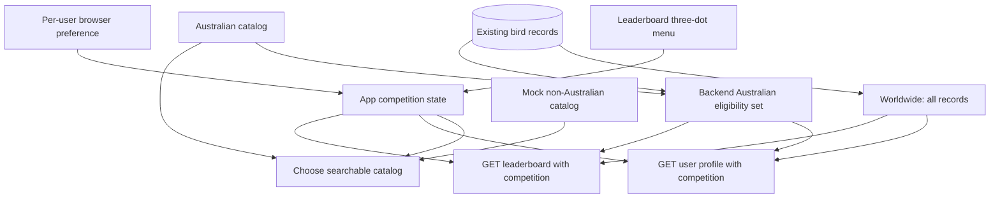

# feat: Add worldwide competition

## Goal Capsule

**Objective:** Wing Watch users can compete on either Australian sightings or worldwide sightings, with accurate rankings and lists for both competitions and their last selection restored when they return.

**Means:** Add an app-wide competition scope, a mocked non-Australian catalog, scoped leaderboard/profile API responses, and per-user browser persistence without changing stored sightings (KTD1–KTD6).

**Authority:** The Product Contract defines user-visible behavior. The Planning Contract defines the implementation boundaries. Existing repository behavior governs details not settled here.

**Stop conditions:** Stop for a product decision if implementation shows that historical sightings cannot be classified reliably from their stored names, or if remembering the choice must work across browsers and devices rather than in the current browser.

**Execution profile:** Standard, cross-layer feature. Implement U1–U3 in dependency order, verify each unit before proceeding, and preserve unrelated working-tree changes. Commit or publish only when separately requested.

---

## Product Contract

### Summary

Add Australian and Worldwide competition views to the existing app. Australia remains the default for people without a saved preference. Worldwide uses the Australian catalog plus mocked non-Australian birds, and the selected competition controls rankings, searchable birds, counts, and displayed user lists.

### Problem Frame

Wing Watch currently treats every stored sighting as part of one Australian competition. That prevents users from recording non-Australian birds without also corrupting the meaning of the Australian leaderboard.

The new competition must work with the sightings already stored for every user. Australian sightings should require no migration or manual re-entry and must count in both competitions.

### Requirements

- R1. **Two competition scopes:** The app must support `Australia` and `Worldwide` as distinct competition choices.
- R2. **Australian default:** A user with no valid saved choice must enter the Australian competition.
- R3. **Remembered choice:** When a user selects Worldwide, that choice must be restored for the same username on the same browser the next time they use the app. The same applies when they switch back to Australia.
- R4. **Menu selection:** The dashboard leaderboard must provide an accessible three-dot menu for changing competitions and clearly label the currently displayed competition.
- R5. **Worldwide eligibility:** Worldwide must include every Australian catalog bird and every mocked non-Australian bird. Combining the catalogs must not create duplicate choices or duplicate counts.
- R6. **Existing sightings:** All existing Australian sightings must continue to count in the Australian competition and must automatically count in Worldwide without database migration, backfill, or user action.
- R7. **Scoped ranking:** Australian rankings must count only sightings classified as Australian. Worldwide rankings must count all stored sightings. Both scopes must preserve the existing descending sort, top-ten limit, and crown behavior.
- R8. **Scoped lists and entry:** The selected competition must control the add-bird search, the signed-in user's displayed list/count, and another user's displayed list/count. Worldwide search must include both catalogs; Australian search must not expose non-Australian mock birds.
- R9. **Existing sighting lifecycle:** Adding and deleting sightings must continue to use the existing stored record format and duplicate-prevention behavior.
- R10. **Mock data boundary:** Initial non-Australian species must live in `frontend/src/nonAustralianBirds.ts` and be clearly marked as temporary mock data that can later be replaced by a complete source.

### Key Decisions

- **One sighting list feeds both competitions.** A bird is recorded once and each competition decides whether it is eligible. Governs R5–R9.
- **Australia is the compatibility default.** Existing clients and users without a preference retain the current experience. Governs R2, R4, R7, R8.
- **The remembered choice is browser-local and per username.** This satisfies return visits without introducing account schema changes. Governs R3.

### Key Flows

- F1. **Select a competition:** The user opens the dashboard menu, selects a scope, sees that scope's leaderboard load, and then sees the same scope applied in My List and any competitor list they open.
- F2. **Return to the app:** After a user has selected Worldwide, closing and reopening the app or logging in again on the same browser restores Worldwide before competition data is requested.
- F3. **Record a worldwide bird:** In Worldwide, the user can search Australian and mocked non-Australian species, add one sighting, and see the worldwide count and ranking refresh.
- F4. **Return to Australia:** Switching to Australia hides non-Australian sightings from competition lists and counts without deleting them; switching back to Worldwide reveals them again.

### Acceptance Examples

- AE1. Given a username with no saved competition preference, when the dashboard opens, then the Australian leaderboard is selected and only Australian sightings are counted.
- AE2. Given a user who selects Worldwide, when that username returns in the same browser, then Worldwide is selected and its leaderboard is requested without another menu action.
- AE3. Given an existing user with five Australian sightings, when Worldwide is selected, then all five count in Worldwide; when Australia is selected, the same five count there.
- AE4. Given a user with five Australian sightings and one mocked non-Australian sighting, Australia shows five while Worldwide shows six, and the stored list still contains six records.
- AE5. Given Worldwide is selected, when the user searches for a mocked non-Australian bird, then it appears alongside eligible Australian results and can be added once.
- AE6. Given an invalid competition query or corrupt saved preference, the API rejects the invalid query while the frontend safely falls back to Australia.

### Scope Boundaries

#### In Scope

- A two-option competition selector in the existing dashboard leaderboard card.
- Browser-local, per-username preference persistence.
- Mocked non-Australian catalog data in one dedicated file.
- Competition-aware leaderboard and user-profile responses.
- Competition-aware search, counts, and list displays.
- Compatibility with existing stored sightings.

#### Deferred to Follow-Up Work

- Replacing mock data with a complete and maintained worldwide taxonomy.
- Adding eBird URLs for non-Australian mock species.
- Syncing the selected competition across browsers or devices through the user account.
- Replacing stored bird-name strings with stable taxonomy identifiers.

#### Considered and Not Built

- Separate Australian and worldwide sighting tables are not needed because the same sighting legitimately belongs to both scopes.
- A database migration or historical backfill is not planned because existing records contain the common and scientific names needed for classification.
- New competition seasons, date windows, scoring weights, and tie-break rules are not part of this change; evidence that worldwide competition needs different scoring would reopen that decision.
- Cleanup of `backend/src/index-postgresql.ts` is excluded. Railway and `backend/package.json` start `dist/index.js`, which is compiled from `backend/src/index.ts`; deleting the historical duplicate is unrelated maintenance.

---

## Planning Contract

### Key Technical Decisions

- KTD1. **Use one shared competition vocabulary:** Define an `australia | worldwide` competition type at the frontend and backend boundaries. Query parsing must default a missing value to Australia and reject unsupported explicit values.
- KTD2. **Compose, do not copy, the worldwide catalog:** `frontend/src/nonAustralianBirds.ts` exports mocked `Bird` records. Frontend competition helpers derive the worldwide catalog from Australian plus non-Australian records and deduplicate by scientific name. The Australian source remains authoritative for Australian eligibility.
- KTD3. **Persist preference per username in local storage:** Store a validated competition value under a username-specific key. Read it after the username is known during restored sessions and successful login. Missing or malformed values resolve to Australia. Logout removes the active session but does not erase the user's competition preference.
- KTD4. **Scope existing records without changing storage:** Backend helpers parse the scientific name from the existing `Common Name (Scientific Name)` format and compare it with the backend Australian catalog. A canonical full-name fallback covers malformed or legacy strings that still exactly match a catalog record. Worldwide eligibility accepts every stored sighting. This keeps historical Australian records in both competitions.
- KTD5. **Filter on the server for authoritative counts:** Add the competition query to leaderboard and user-profile reads. The server returns only eligible birds and derives `birdCount` from that filtered list. The frontend must not reconstruct rankings from partial client data.
- KTD6. **Keep selection app-wide:** The top-level `App` owns the selected competition. Dashboard, My List, viewed user lists, leaderboard requests, profile requests, and bird search all receive the same value. Changing scope clears any selected search result so a hidden bird cannot be submitted accidentally.
- KTD7. **Reuse existing interaction patterns:** Implement the three-dot selector as an ARIA menu button with `aria-expanded` and a labelled menu containing two `menuitemradio` options. Opening focuses the active option; arrow keys move between options; Enter or Space selects; Escape closes the menu and restores focus to the trigger. Also reuse the existing ref-based outside-click pattern from the bird-search dropdown. The current competition name remains visible even when the menu is closed.

### High-Level Technical Design

The diagram describes ownership and data flow. The API remains the authority for counts and profile lists; the frontend catalog controls which birds a user can select for entry.

| Scope | Search catalog | Leaderboard/profile eligibility | Missing saved preference |
|---|---|---|---|
| Australia | Australian birds | Australian-classified stored sightings | Selected |
| Worldwide | Australian plus mocked non-Australian birds | All stored sightings | Not selected |

### Implementation Constraints

- Preserve the existing bird storage shape and endpoint response fields; the competition query is additive.
- Preserve the existing top-ten leaderboard behavior and duplicate prevention.
- Do not overwrite or regenerate `australianBirds.ts` while implementing this feature.
- Mock entries must use the existing `Bird` shape: common name, scientific name, and family.
- URL buttons remain absent when no entry exists in `australianBirdsUrls.ts`; missing worldwide URLs are not errors.
- Menu and selection controls must be keyboard operable, expose an accessible label, and remain usable at the current mobile breakpoint.

### System-Wide Impact

- **Data lifecycle:** No rows are changed. Competition scope affects reads and available additions only. Deleting a bird removes the one underlying sighting from both scopes.
- **API compatibility:** Calls without `competition` continue to receive Australian results. Existing response object shapes remain stable.
- **Identity:** Preference persistence is tied to the normalized username used by the current login flow and stays local to that browser.
- **Performance:** The current data volume allows in-memory filtering after Prisma loads each user's birds. If sightings grow materially, database-level classification or stable taxonomy IDs should replace this approach.
- **Documentation:** README descriptions, API query documentation, and usage steps must distinguish Australian and Worldwide behavior.

### Risks & Dependencies

- Historical records depend on the stored `Common Name (Scientific Name)` convention. KTD4 reduces rename risk by preferring scientific-name matching and falling back to exact canonical strings.
- The backend and frontend hold separate Australian catalog copies. Implementation must verify that their scientific-name sets agree for the records used in tests; a future shared package is deferred until drift becomes a demonstrated problem.
- `App.tsx` currently owns most UI and request behavior and has little automated coverage. Characterization and focused integration tests should precede the UI refactor.
- Browser-local preference is intentionally not cross-device. A future account-level preference would require a schema/API change and supersede KTD3.

---

## Implementation Units

### U1. Add competition catalogs and preference helpers

**Goal:** Provide a typed, deterministic frontend source for Australian and Worldwide search plus safe per-user preference persistence.

**Requirements:** R1–R3, R5, R8, R10; F2; AE1, AE2, AE5, AE6.

**Dependencies:** None.

**Files:**

- Create `frontend/src/nonAustralianBirds.ts`
- Create `frontend/src/competition.ts`
- Create `frontend/src/competition.test.ts`
- Read and reuse `frontend/src/australianBirds.ts`

**Approach:**

1. Add a small, clearly labeled mock list of non-Australian `Bird` records without modifying the Australian dataset.
2. Define the competition type, labels, storage-key construction, value validation, catalog selection, deduplication, and search helpers in `competition.ts`.
3. Return the Australian catalog unchanged for Australia and a scientific-name-deduplicated union for Worldwide.
4. Persist and load the selected scope per username. Default missing, inaccessible, or invalid local-storage values to Australia.

**Execution note:** Implement the catalog and persistence behavior test-first because it is pure logic and forms the contract used by the UI.

**Patterns to follow:** Reuse the `Bird` interface and case-insensitive common/scientific/family matching behavior in `frontend/src/australianBirds.ts`. Match the existing `wingwatch-user` local-storage error handling in `frontend/src/App.tsx`.

**Test scenarios:**

- Covers AE1. Loading with no saved value returns Australia.
- Covers AE2. Saving Worldwide for one username restores Worldwide for that username on the next load.
- A saved choice for one username does not affect a different username on the same browser.
- Covers AE6. An unsupported saved value falls back to Australia without throwing.
- Australia returns only the Australian catalog.
- Covers AE5. Worldwide search returns matching Australian and mocked non-Australian birds.
- A duplicate scientific name present in both source arrays appears once in Worldwide.
- Empty search returns the complete catalog for the selected competition.

**Verification:** Pure helper tests pass, the mock file is the only new bird-data source, and catalog results preserve the existing `Bird` shape and search behavior.

### U2. Add competition-aware API counts and lists

**Goal:** Make leaderboard rankings and user-profile lists authoritative for the requested competition while counting historical sightings correctly.

**Requirements:** R1, R2, R5–R9; F3, F4; AE1, AE3, AE4, AE6.

**Dependencies:** None. The shared competition vocabulary must match U1, but the units may be implemented independently before integration.

**Files:**

- Create `backend/src/competition.ts`
- Create `backend/src/competition.test.ts`
- Modify `backend/src/index.ts`
- Modify `backend/package.json`
- Modify `backend/package-lock.json` only if the chosen test runner requires dependency changes
- Read and reuse `backend/src/australianBirds.ts`

**Approach:**

1. Extract pure helpers for query parsing, stored-name parsing, Australian eligibility, list filtering, and count/rank projection.
2. Default a missing competition query to Australia and return a client error for an unsupported explicit value.
3. Update `GET /api/leaderboard` to filter each user's sightings before counting, sorting, and taking the top ten.
4. Update `GET /api/users/:username` to return a filtered `birdList` and matching `birdCount` for the same scope.
5. Leave create/delete storage behavior unchanged so one underlying sighting participates in every eligible scope.

**Execution note:** Characterize current ranking, list, and top-ten behavior before changing the endpoints; then add the two-scope cases around the extracted pure functions.

**Patterns to follow:** Preserve Prisma reads and response mapping in `backend/src/index.ts`. Use the `commonName`, `scientificName`, and existing stored-name construction from the two Australian dataset files as the classification contract.

**Test scenarios:**

- Covers AE1. Missing competition input resolves to Australia.
- Covers AE6. Unsupported competition input is rejected rather than silently producing a different leaderboard.
- Covers AE3. Historical Australian records with canonical stored names are eligible in both scopes.
- A historical record whose common name changed but whose scientific name still matches remains Australian.
- Covers AE4. A user with five Australian and one non-Australian record receives counts of five for Australia and six for Worldwide.
- An Australian profile response excludes non-Australian records and its `birdCount` equals the returned list length.
- A Worldwide profile returns every stored record exactly once.
- Ranking remains descending and capped at ten after scope filtering.
- Users with zero eligible Australian sightings do not gain points from worldwide-only records.

**Verification:** Backend tests prove query parsing, legacy classification, profile filtering, sorting, and top-ten behavior. The TypeScript build passes with no Prisma schema or migration changes.

### U3. Connect the competition menu to rankings, lists, and bird entry

**Goal:** Let users switch competitions from the leaderboard and keep every screen aligned with the remembered selection.

**Requirements:** R1–R9; F1–F4; AE1–AE6.

**Dependencies:** U1 and U2.

**Files:**

- Modify `frontend/src/App.tsx`
- Modify `frontend/src/App.css`
- Create `frontend/src/App.test.tsx`
- Modify `README.md`

**Approach:**

1. Initialize top-level competition state only after the active username is known, using U1's validated persistence helper.
2. Add the three-dot trigger and two-option menu to the leaderboard header. Show `Australian Comp` or `Worldwide Comp` in the heading and identify the active menu item.
3. On selection, persist the choice, clear any selected bird/search text, close the menu, clear leaderboard rows from the previous scope, and reload the dashboard in the chosen scope. While loading, show a scope-named loading state instead of stale rows; on failure, keep the selected scope and show a visible retry action.
4. Include the scope query in leaderboard and profile requests. Pass the same scope when opening My List or another user's list.
5. Give `AddBirdForm` the selected catalog/search function so Australia exposes only Australian birds and Worldwide exposes the combined catalog.
6. Keep `BirdList` presentation unchanged apart from receiving the server-filtered list. Worldwide mock birds without URL entries render without an info button.
7. Add responsive and focus-visible styles for the menu without changing existing leaderboard-row behavior.
8. Update README feature, API, data, and usage sections to explain the two competitions and temporary mock dataset.

**Execution note:** Add characterization coverage for login restoration, dashboard loading, and list navigation before restructuring `App.tsx`; then add the menu and persistence scenarios.

**Patterns to follow:** Reuse top-level state/request ownership, the `wingwatch-user` restoration flow, `loadDashboardData`, `loadUserProfile`, and the ref/outside-click pattern in `AddBirdForm`. Preserve existing leaderboard buttons and mobile-first CSS conventions.

**Test scenarios:**

- Covers AE1. A user without a saved preference sees `Australian Comp`, and the first leaderboard request uses Australia.
- Covers AE2. A saved Worldwide preference is restored before the initial leaderboard request, and Worldwide remains selected after navigating away and back.
- Opening the three-dot menu exposes both options, marks the current option, and closes after selection or an outside click.
- Keyboard users can focus the trigger, open the menu with focus on the active option, move between options with arrow keys, select with Enter or Space, and close with Escape while focus returns to the trigger; accessible names and radio states identify the active value.
- Covers AE5. Worldwide search includes a mock non-Australian species and an Australian species; Australian search excludes the mock species.
- Changing scope clears a previously selected bird so a result from the old catalog cannot be submitted.
- Covers AE4. Dashboard ranking, My List count/list, and a viewed competitor's count/list all request and render the selected scope.
- A non-Australian bird with no URL mapping renders without an information button and without an error.
- Adding or deleting a bird refreshes leaderboard and profile data using the current scope.
- Changing scope hides or clears leaderboard rows from the previous scope and shows a scope-named loading state until the selected competition's response arrives.
- An API error during a scoped request preserves the current selection, does not show rows from another scope, and presents a visible retry action.
- At the mobile breakpoint, the menu stays within the leaderboard card and does not overlap ranking controls.

**Verification:** Frontend tests cover restoration, menu operation, scoped requests, catalog switching, and navigation. The production build passes, and manual desktop/mobile checks confirm the complete F1–F4 flow.

---

## Verification Contract

### Automated Checks

- **Frontend behavior:** From `frontend`, run the React test suite non-interactively. The suite must include `competition.test.ts` and `App.test.tsx`.
- **Frontend production build:** From `frontend`, run the production build with no TypeScript or bundling errors.
- **Backend behavior:** From `backend`, run the added test script covering `competition.test.ts`.
- **Backend production build:** From `backend`, run the existing build, including Prisma generation and TypeScript compilation.
- **Repository hygiene:** Diff checks pass, no Prisma migration appears, and `backend/src/index-postgresql.ts` remains outside the change.

### Manual Product Checks

1. Log in as a user with existing Australian sightings and confirm the Australian count is unchanged.
2. Select Worldwide from the three-dot menu and confirm the same Australian sightings count automatically.
3. Add one mocked non-Australian bird in Worldwide. Confirm Worldwide increases while Australia does not.
4. Reload the app and log in again as the same username. Confirm Worldwide is restored.
5. Log in as a different username in the same browser. Confirm that user's independent saved choice is used, otherwise Australia is the default.
6. Open My List and another user's list in each scope. Confirm headings, counts, and rows agree with the selected competition.
7. Check the menu and leaderboard at phone and desktop widths with mouse and keyboard input.

### Coverage Exceptions

- No migration test is needed because the schema does not change.
- A complete-world-taxonomy test is not possible with mock data; U1 tests the composition and deduplication contract that the real dataset must satisfy later.

---

## Definition of Done

### Global

- Both competition options are available from the dashboard leaderboard menu.
- Australia is the default only when the active username has no valid saved preference.
- The selected scope persists per username in the current browser and applies across dashboard, My List, user lists, search, add, delete, and refresh flows.
- Existing Australian sightings count in both competitions without data changes.
- Non-Australian sightings count only in Worldwide and remain stored when hidden in Australia.
- Automated checks and manual product checks in the Verification Contract pass.
- README documentation matches the delivered behavior and identifies the worldwide data as mocked.
- No abandoned experiments, duplicate competition logic, generated build output, or unrelated cleanup remains in the diff.

### Per Unit

- **U1:** Catalog composition, search, deduplication, and per-user preference helpers are covered and pass.
- **U2:** Scoped backend counts, lists, historical classification, ranking order, and top-ten behavior are covered and pass without a migration.
- **U3:** Menu selection, restoration, scoped requests, navigation, bird entry, accessibility, and responsive presentation are covered and pass.
